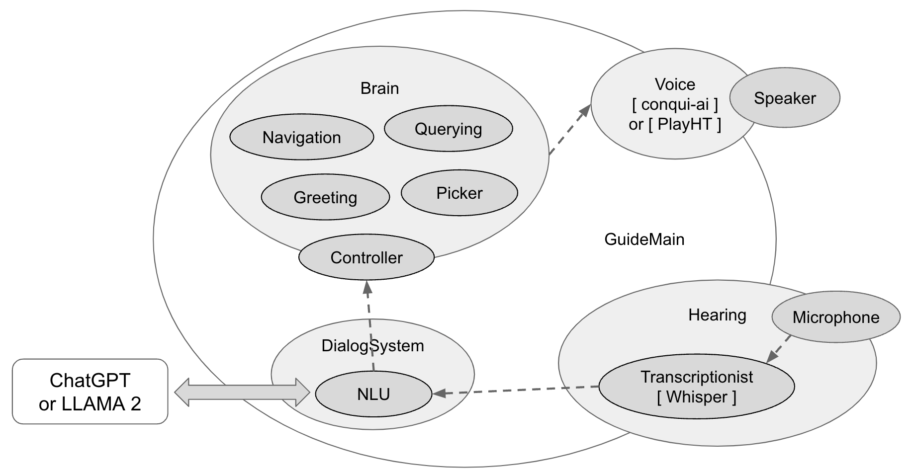

# Hola Dialog
This application utilizes the [Agent BDI framework](https://github.com/mfshiu/agent-bdi) to illustrate key functionalities in robotic dialogue, such as voice input, semantic interpretation, action execution, and voice output. For voice-to-text conversion, the program employs [OpenAI Whisper](https://github.com/openai/whisper), while semantic understanding is facilitated through [ChatGPT](https://chat.openai.com/) or [LLAMA 2](https://ai.meta.com/llama/). [Conqui AI](https://github.com/coqui-ai/TTS) or [PlayHT 2.0](https://play.ht/conversational/) are implemented for text-to-speech output. Currently, action execution is primarily simulation-based, with plans to incorporate ROS in subsequent iterations.

The robot is already equipped with the capacity to respond to greetings and to simulate directional assistance.


## Setup
Initialize and activate the virtual environment, making sure to use the validated Python version 3.10.11. Subsequently, install the required packages. The operating system compatibility includes Ubuntu 20.04 and Ubuntu 22.04.
````
sudo apt-get install portaudio19-dev
pip install -r requirements.txt
````
Create guide_config.py, rewite settings such as mqtt and openai key. 
````
cp guide_config-sample.py guide_config.py
````
Start the main program in one Nvidia supported machine.
````
python start.py
````
Start the transcription program in another Nvidia supported machine.
````
python run_trans.py
````
## Distributed architecture
Distributed system architecture.


## Change agent
### Change to Conqui-UI TTS
Edit guide_main.py.
````
self.head_agents.append(ConquiVoice(cfg))
# self.head_agents.append(PlayHTVoice(cfg))
````
### Replace ChatGPT with LLAMA 2
First, ensure *llama-2-7b-chat* or *llama-2-13b-chat* in *dialog/nlu/llama*.

Edit dialog/nlu/__init__.py.
````
# from dialog.nlu.chatgpt_nlu import ChatGptNlu
# from dialog.nlu.llama_nlu import LlamaNlu

# self.body_agents.append(ChatGptNlu(cfg))
# self.body_agents.append(LlamaNlu(cfg))
````
Start the llama agent in supported machine.
````
torchrun --nproc_per_node 1 run_llama.py
````
If you want use 13b model of Llama 2, edit dialog/nlu/llama_nlu.py, and start with 2 of parameter nproc_per_node
````
self.ckpt_dir = "dialog/nlu/llama/llama-2-13b-chat/"

torchrun --nproc_per_node 2 run_llama.py
````
